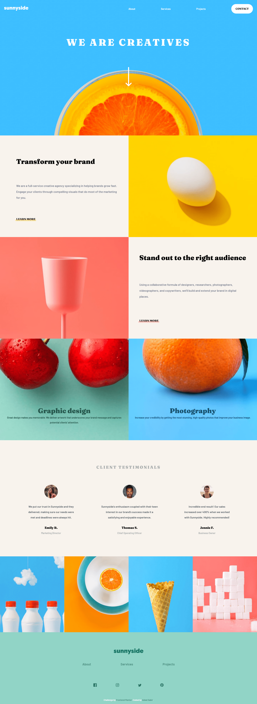
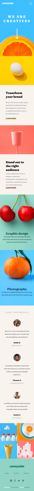
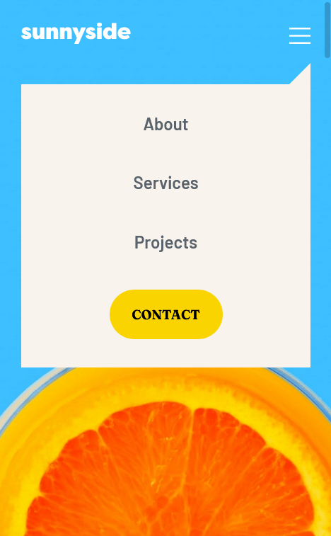

# Frontend Mentor - Sunnyside agency landing page solution

This is a solution to the [Sunnyside agency landing page challenge on Frontend Mentor](https://www.frontendmentor.io/challenges/sunnyside-agency-landing-page-7yVs3B6ef). Frontend Mentor challenges help you improve your coding skills by building realistic projects.

## Table of contents

- [Overview](#overview)
  - [The challenge](#the-challenge)
  - [Screenshot](#screenshot)
  - [Links](#links)
- [My process](#my-process)
  - [Built with](#built-with)
  - [What I learned](#what-i-learned)
  - [Continued development](#continued-development)
  - [Useful resources](#useful-resources)
- [Author](#author)
- [Acknowledgments](#acknowledgments)

**Note: Delete this note and update the table of contents based on what sections you keep.**

## Overview

The objective of this excercise was to build a responsive landing page.

### The challenge

Users should be able to:

- View the optimal layout for the site depending on their device's screen size
- See hover states for all interactive elements on the page

### Screenshot





### Links

- Solution URL: [Add solution URL here](https://github.com/asab07/sunnyside-landing-page)
- Live Site URL: [Add live site URL here](https://github.com/asab07/sunnyside-landing-page/settings/pages)

## My process

### Built with

- Semantic HTML5 markup
- SASS
- Flexbox
- CSS Grid
- Mobile-first workflow
- JavaScript - just for the mobile functionality

### What I learned

In this project, I learned the most about CSS and SASS. I learned how to use Grid, Flexbox, and mixins. I found mixins to be highly useful for repeating components or the ones with overlapping properties. For instance, the following mixin was very helpful in quickly defining an html div with a backgound an appropriate background for either the desktop or the mobile version:

```css
@mixin bg-url($imgPath: "/images/mobile", $img: "image-header.jpg") {
  background-image: url(map-get($asset-paths, $imgPath) + map-get($backgrounds, $img));
}
```

### Continued development

In the future, I want to focus more the projects involving JavaScript and its frameworks.

### Useful resources

- [Kevin Powell's YouTube Channel](https://www.youtube.com/kepowob) - Kevin Powell's channel is one of the best if you are looking for a helpful resource on CSS. I really like his teaching style and the quality of his content.
- [Web Dev Simplified](https://www.youtube.com/c/WebDevSimplified) - Another excellent and highly qualified developer. Kyle's videos are precise and to the point, but with a lot of concentrated knowledge.
- [CSS Flexbox Guide](https://css-tricks.com/snippets/css/a-guide-to-flexbox/) - This is a great guide to understanding CSS Flexbox - an amazing article with visual aids and examples. I'd recommend it to anyone still learning this concept.

## Author

- Website - [Adeel Sabir](https://github.com/asab07)
- Frontend Mentor - [@asab07](https://www.frontendmentor.io/profile/asab07)

## Acknowledgments

I would like to thank the team at Frontendmentor.io for sharing their knowledge and providing an excellent platform to new learners.
